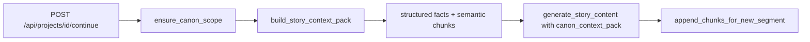
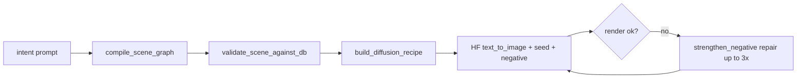

# Text → Image continuity workflows

This document matches the implementation under `backend/` (canon lore, retrieval, scene graph, prompt builder, HF render, validator).

## 1. Story continuation (canon on)

- **Structured facts** come from PostgreSQL (`canon_character`, `party_slot`, `creature_instance`, `world_state_kv`, `canon_event`, `visual_bible`).
- **Semantic** top-k from `lore_chunk.embedding` (float array) vs query embedding (HF feature-extraction).
- Sliding window `previous_content[-5000:]` is **not** used when `canon_context_pack` is supplied (`CANON_ENGINE_ENABLED` default on).

## 2. Image generation (canon ready)

- **IP-Adapter / ControlNet**: not exposed by Hugging Face Inference `text_to_image`; `DiffusionRecipe.ip_adapter_weight` is reserved for a future GPU worker. Prompt + seed + negative still reduce drift vs raw user text.

## 3. Bootstrap canon (minimal path)

1. `POST /api/projects/{id}/canon/scope` (optional; other endpoints auto-create scope).
2. `POST .../characters` — e.g. `napoleon`, display name.
3. `POST .../visual-variant` — outfit + `face_marks_json` (e.g. scar).
4. `POST .../creatures` — three calls for Charizard / Alakazam / Gyarados with `stage_key`.
5. `POST .../party/rebuild` — ordered `creature_instance_ids`.
6. `POST .../locations` — `indigo_plateau`, display name.
7. `PUT .../visual-bible` — `negative_bank`, `style_pack_json.positive_style_suffix`, optional `seed_override`.
8. `POST .../reindex` — chunk + embed `projects.content` into `lore_chunk`.

## 4. Repair loop

On render exception only, the pipeline strengthens `negative` and raises `guidance_scale` (capped). Continuity violations **fail fast** before render (team/outfit graph vs DB).

## 5. Environment flags

| Variable | Default | Role |
|----------|---------|------|
| `CANON_ENGINE_ENABLED` | `true` | Toggle canon story + image paths |
| `CANON_EMBEDDING_MODEL` | `sentence-transformers/all-MiniLM-L6-v2` | HF embedding id |
| `CANON_CHUNK_CHARS` | `900` | Chunk size for lore indexing |
| `CANON_PROSE_TAIL_CHARS` | `0` | Optional tail of raw prose for tone only |
| `CANON_IMAGE_GUIDANCE` / `CANON_IMAGE_STEPS` | `7.5` / `28` | Diffusion params |

## 6. Future: GPU worker

Replace `image_pipeline/hf_render.py` with a queue consumer (Redis + worker) that accepts `DiffusionRecipe` JSON and runs ComfyUI / diffusers with IP-Adapter + ControlNet; FastAPI returns `job_id` and polls for `asset` URI.
