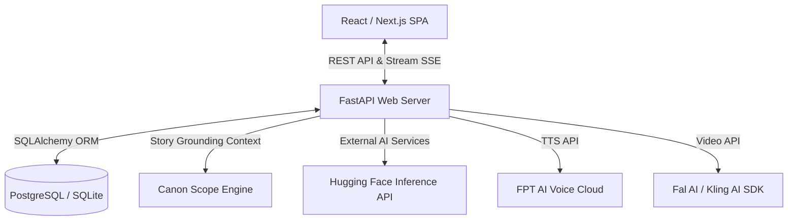

# AI Content Generator Platform - Presentation Slides

This document is formatted as a Markdown presentation (Marp-compatible) to help you easily build slides for the project. Each slide is separated by `---`.

---

<!-- _class: lead -->
# 🚀 AI CONTENT GENERATOR PLATFORM
## Hệ Thống Sáng Tác Nội Dung Đa Phương Tiện Nhất Quán (NT208)

**Thành viên thực hiện:** [Tên Nhóm]  
**Môn học:** Phát Triển Ứng Dụng Web (NT208)

---

## 👥 1. Đối Tượng Sử Dụng Mục Tiêu (Target Users)

*   **✍️ Nhà văn, tác giả tự do (Indie Writers / Novelists):**
    *   Sáng tác tiểu thuyết mạng, truyện dài kỳ.
    *   Cần độ nhất quán cao về cốt truyện, tính cách và diện mạo nhân vật qua hàng chục chương.
*   **🎬 Người sáng tác nội dung video (Content Creators):**
    *   TikTokers, YouTubers làm video kể chuyện, hoạt hình ngắn.
    *   Cần tích hợp nhanh: Kịch bản ➡️ Giọng đọc ➡️ Ảnh minh họa ➡️ Phân cảnh video.
*   **🎨 Biên kịch truyện tranh & Webtoon:**
    *   Viết kịch bản phân cảnh, lời thoại cho họa sĩ minh họa.
    *   Cần tạo ảnh phác thảo (Concept Art) định hướng hình ảnh.
*   **🎮 Nhà phát triển game độc lập (Indie Game Devs):**
    *   Xây dựng cốt truyện nền (Lore), lời thoại cho lượng lớn nhân vật/NPC.

---

## 🎯 2. Nhu Cầu Cốt Lõi & Giải Pháp (User Needs)

| Vấn đề của người dùng (Pain Points) | Giải pháp của Hệ thống (Our Solutions) |
| :--- | :--- |
| **Mất nhất quán cốt truyện**   (AI phổ thông bị trôi ngữ cảnh khi viết dài) | **Engine Độc Lập & RAG**   Quản lý Canon Scope (Lore Chunks) để ghi nhớ nhân vật/bối cảnh dài hạn. |
| **Quy trình rời rạc**   (Phải dùng riêng lẻ ChatGPT, Midjourney, TTS...) | **Workspace Đa Phương Tiện Tích Hợp**   Viết text, sinh ảnh, phát âm thanh và video trong 1 cửa sổ. |
| **Quản lý hội thoại lộn xộn**   (Dạng chat dài không có cấu trúc dự án) | **Quản lý theo Dự án (Project-Based)**   Lưu trữ dạng Project, quản lý lịch sử thông minh. |
| **Hợp tác đội nhóm thủ công**   (Chia sẻ tài liệu qua file text rời rạc) | **Không gian cộng tác nhóm (Teams)**   Chia sẻ tài nguyên và dùng chung API Key trong nhóm. |

---

## 💡 3. Các Tính Năng Core Hệ Thống (Key Features)

*   **📝 Creative Writing Engine (Text):**
    *   Viết kịch bản/truyện dài kỳ đa ngôn ngữ (Việt/Anh).
    *   Streaming nội dung thời gian thực.
*   **🖼️ Concept Art Generator (Image):**
    *   Tạo hình ảnh nhân vật, bối cảnh với FLUX.1 & Stable Diffusion.
*   **🔊 Text-to-Speech (Audio):**
    *   Chuyển đổi kịch bản thành giọng đọc truyền cảm bằng FPT AI TTS v5.
*   **🎥 Scene Generator (Video):**
    *   Tạo phân cảnh video ngắn chuyển động mượt mà từ prompt qua Fal/Kling.
*   **🏷️ Auto-Naming & Video Saving:**
    *   Tự động đặt tên dự án bằng AI thông minh (thay thế "AI Template Draft").
    *   Lưu trữ lịch sử chat video, phát lại và tiếp tục sinh video trên dự án cũ.

---

## 🛠️ 4. Kiến Trúc Kỹ Thuật (System Architecture)

---

## 💻 5. Công Nghệ Sử Dụng (Technology Stack)

*   **Frontend (Ứng dụng Web):**
    *   **Core:** React 19, Next.js 16 (App Router).
    *   **Styling & UI:** TailwindCSS, Tailwind Merge, Lucide Icons, Shadcn UI.
*   **Backend (Máy chủ dịch vụ API):**
    *   **Framework:** Python FastAPI.
    *   **Database & ORM:** PostgreSQL/SQLite, SQLAlchemy ORM.
*   **Tích hợp AI Models:**
    *   **Text LLM:** Qwen/Qwen2.5-72B-Instruct, Llama (qua HF Inference Client).
    *   **Image:** black-forest-labs/FLUX.1-schnell, Stability AI SDXL.
    *   **Audio:** FPT TTS AI v5 Engine.
    *   **Video:** fal-ai/minimax-video, Kling AI.

---

## 🌟 6. Điểm Nhấn Sáng Tạo (What Makes Us Unique?)

1.  **Tính nhất quán tuyệt đối nhờ RAG (Retrieval-Augmented Generation):**
    *   Hệ thống không chỉ gửi prompt đơn thuần mà tự động truy vấn Lore Chunks từ cơ sở dữ liệu để đóng gói ngữ cảnh đầy đủ nhất gửi tới LLM.
2.  **Trải nghiệm người dùng cao cấp (Premium UI/UX):**
    *   Thiết kế Dark/Light mode hiện đại, bo góc mềm mại, các hiệu ứng glassmorphism thời thượng.
    *   Trình soạn thảo composer gọn gàng hỗ trợ upload file tài liệu đính kèm và nhận diện giọng nói (Speech-to-Text).
3.  **Tự động hóa thông minh (Automated Smart Helpers):**
    *   Nút "Tự đặt tên" gọi LLM tóm tắt nhanh prompt của người dùng thành tên dự án ngắn gọn (2-4 từ).

---

<!-- _class: lead -->
# Thank You!
## 📧 Q&A - Hỏi đáp về hệ thống
